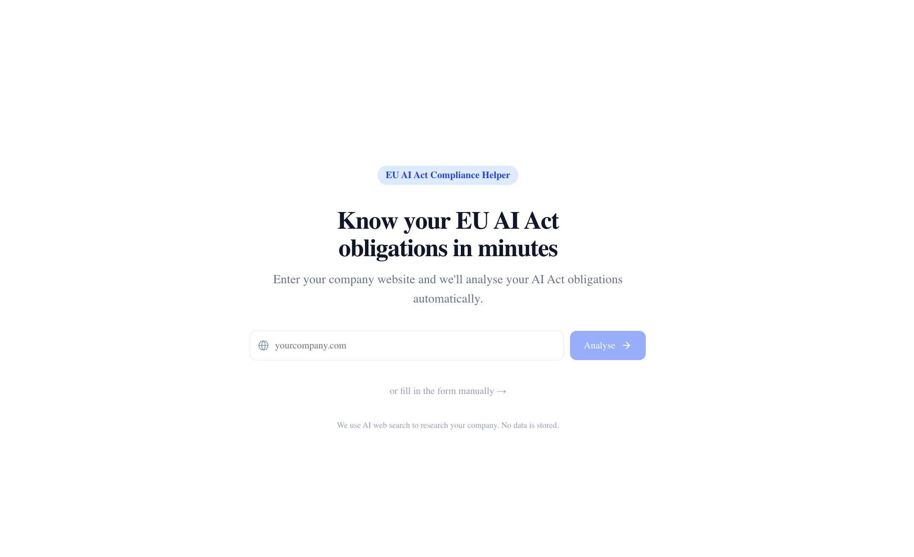

# EU AI Act Compliance Helper

Know your EU AI Act obligations in minutes.



Enter your company website and the tool will automatically research your AI systems, classify them under the EU AI Act, and generate a tailored compliance report — no legal expertise required.

---

## How it works

1. **Enter your company URL** — the tool uses AI web search to research your company and pre-fill the assessment form automatically.
2. **Review or fill in the form** — a 7-step wizard covers your company details, AI system description, deployment context, and risk flags. You can edit anything the AI pre-filled.
3. **Get your compliance report** — the tool classifies your AI system (Prohibited / High-risk / Limited / Minimal / Excluded) and generates a detailed report with specific EU AI Act article references and actionable obligations.

---

## Getting started

### Prerequisites

- [Node.js](https://nodejs.org/) (LTS)
- An [Anthropic API key](https://console.anthropic.com/)
- Optionally: [mise](https://mise.jdx.dev/) for task shortcuts

### Setup

1. Clone the repo and install dependencies:

```bash
npm install
```

2. Copy the example env file and add your API key:

```bash
cp .env.example .env
```

Then open `.env` and set:

```
ANTHROPIC_API_KEY=your_key_here
```

3. Start the app:

```bash
# With mise
mise r dev

# Without mise
npm run dev
```

The app runs at [http://localhost:3000](http://localhost:3000).

---

## Tech stack

- **Frontend & backend**: [Next.js](https://nextjs.org/) (TypeScript) — a single monorepo, no separate backend service needed
- **AI**: [Anthropic Claude](https://www.anthropic.com/) with web search for company research and compliance report generation
- **UI**: [Tailwind CSS](https://tailwindcss.com/) + [shadcn/ui](https://ui.shadcn.com/)

---

## Disclaimer

This tool is for informational purposes only and does not constitute legal advice. The EU AI Act is complex and its interpretation may vary by jurisdiction and circumstance. Please consult qualified legal counsel for compliance decisions.
